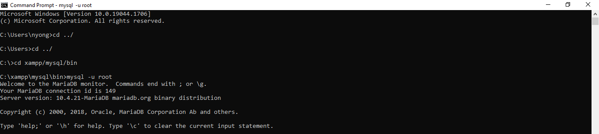
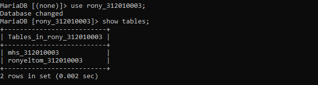
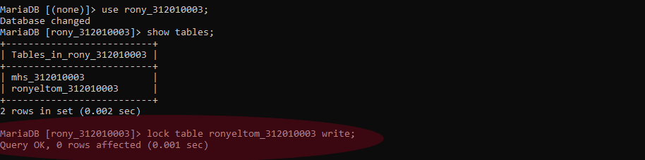
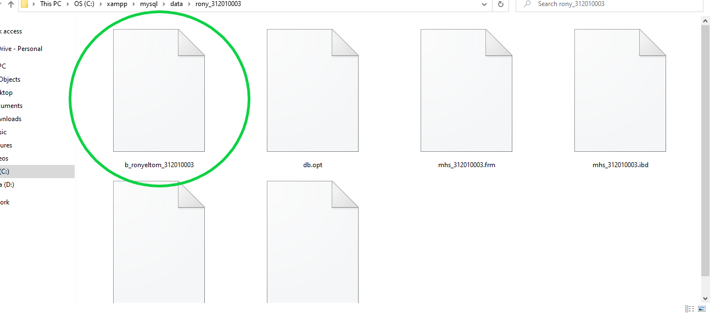
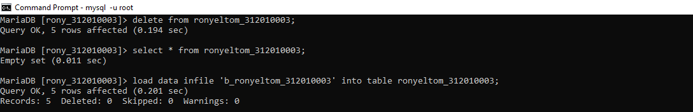
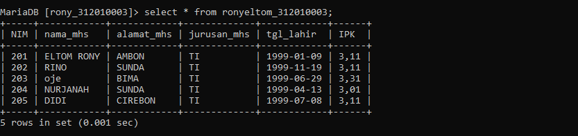
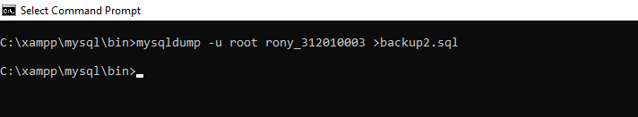
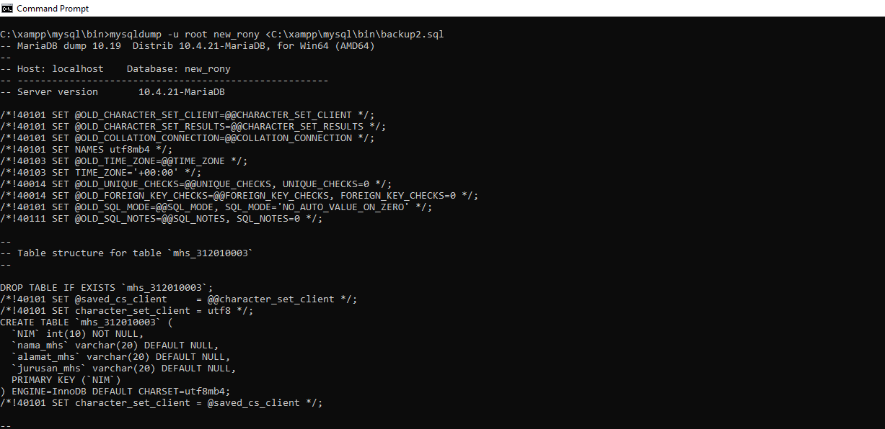

| Rony Eltom Atibaman | 312010003 |
| ------------------- | --------- |
|  SISTEM BASIS DATA  | TI.20.D.1 |

# tugas-6
## Backup Menggunakan Perintah SQL
### Masuk kedalam database
 <br>


### Lakukan proses penguncian table


### Lakukan proses backup table dengan perintah : SELECT *INTO OUTFILE
<br>
> jika proses berhasil maka akan muncul file backup pada direktori `C:\xampp\mysql\data\nama database` <br>
<br>

### data yang telah di backup  dapat di kembalikan kapan saja bila di perlukan.

``` 
LOAD DATA A INFILE Nama_backup_file'INTO TABLE nama_table:
```
<br>


## Restore Menggunakan Periintah SQL
> 1. Menuju ke folder aplikasi mysqldump di xampp/mysql/bin
> 2. Jalankan shell atau command-prompt dan ketikan perintah berikut untuk memulai dump database: `MySQLDUMP -u root -p -alldatabase` <br>
<br>
> data yang di-backup dapat di restore kembali ke dalam, database dengan perintah
```
MySQLdump -u root -p (nama_database) < c:\file_backup.sq
```
<br>


```
00**7mysqldump -u root ronyeltom_312010003>backup2.sq
```

## SEKIAN DAN TERIMAH KASIH


